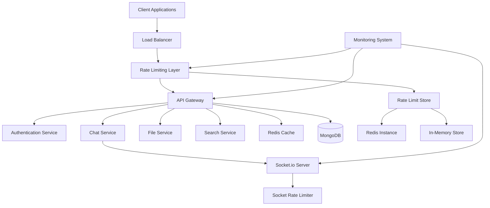

# ChatApp System Design - Rate Limiting Focus

## Overview

This design document outlines the comprehensive enhancement of the existing ChatApp MERN stack application into a production-ready, scalable chat system. The design emphasizes a robust rate limiting strategy as the cornerstone of traffic control and abuse prevention, while incorporating enterprise-level security, performance optimization, and monitoring capabilities.

The enhanced ChatApp will transform from a basic chat application into a high-performance system capable of handling thousands of concurrent users with sophisticated rate limiting mechanisms protecting against various attack vectors and ensuring fair resource allocation.

## Architecture

### High-Level System Architecture



### Rate Limiting Architecture Overview

The rate limiting system operates at multiple layers:

1. **Network Layer**: IP-based rate limiting at the load balancer/reverse proxy level
2. **Application Layer**: Express.js middleware for HTTP API endpoints
3. **Real-time Layer**: Socket.io middleware for WebSocket connections
4. **Authentication Layer**: Specialized rate limiting for login attempts
5. **Category Layer**: Different limits based on endpoint functionality

## Components and Interfaces

### Rate Limiting Components

#### 1. Rate Limit Manager
```typescript
interface RateLimitManager {
  checkLimit(key: string, limit: RateLimit): Promise<RateLimitResult>
  incrementCounter(key: string, window: number): Promise<number>
  resetCounter(key: string): Promise<void>
  getStatus(key: string): Promise<RateLimitStatus>
}

interface RateLimit {
  requests: number
  windowMs: number
  category: RateLimitCategory
}

interface RateLimitResult {
  allowed: boolean
  remaining: number
  resetTime: Date
  retryAfter?: number
}
```

#### 2. Storage Backends
```typescript
interface RateLimitStore {
  get(key: string): Promise<RateLimitData | null>
  set(key: string, data: RateLimitData, ttl: number): Promise<void>
  increment(key: string, ttl: number): Promise<number>
  delete(key: string): Promise<void>
}

// Redis implementation for distributed rate limiting
class RedisRateLimitStore implements RateLimitStore {
  // Lua scripts for atomic operations
  private incrementScript: string
  private checkScript: string
}

// Memory implementation for single-instance deployments
class MemoryRateLimitStore implements RateLimitStore {
  private store: Map<string, RateLimitData>
  private cleanup: NodeJS.Timer
}
```

#### 3. Rate Limit Categories
```typescript
enum RateLimitCategory {
  AUTHENTICATION = 'auth',
  MESSAGING = 'messaging',
  FILE_UPLOAD = 'file_upload',
  SEARCH = 'search',
  GENERAL = 'general'
}

interface CategoryLimits {
  [RateLimitCategory.AUTHENTICATION]: { requests: 20, windowMs: 3600000 } // 20/hour
  [RateLimitCategory.MESSAGING]: { requests: 1000, windowMs: 3600000 } // 1000/hour
  [RateLimitCategory.FILE_UPLOAD]: { requests: 10, windowMs: 3600000 } // 10/hour
  [RateLimitCategory.SEARCH]: { requests: 100, windowMs: 3600000 } // 100/hour
  [RateLimitCategory.GENERAL]: { requests: 100, windowMs: 900000 } // 100/15min
}
```

### API Rate Limiting Design

#### Express.js Middleware Implementation

```typescript
// Primary API rate limiter using express-rate-limit
const createApiRateLimiter = (category: RateLimitCategory) => {
  const limits = CategoryLimits[category]
  
  return rateLimit({
    windowMs: limits.windowMs,
    max: limits.requests,
    
    // Redis store for distributed rate limiting
    store: new RedisStore({
      client: redisClient,
      prefix: `rl:api:${category}:`
    }),
    
    // Custom key generator combining IP and user ID
    keyGenerator: (req: Request) => {
      const ip = req.ip || req.connection.remoteAddress
      const userId = req.user?.id
      return userId ? `${ip}:${userId}` : ip
    },
    
    // Custom response with detailed headers
    handler: (req: Request, res: Response) => {
      const retryAfter = Math.ceil(limits.windowMs / 1000)
      
      res.status(429).set({
        'Retry-After': retryAfter.toString(),
        'X-RateLimit-Limit': limits.requests.toString(),
        'X-RateLimit-Remaining': '0',
        'X-RateLimit-Reset': new Date(Date.now() + limits.windowMs).toISOString()
      }).json({
        error: 'Rate limit exceeded',
        category: category,
        retryAfter: retryAfter,
        message: `Too many ${category} requests. Try again in ${retryAfter} seconds.`
      })
    },
    
    // Skip successful requests for certain categories
    skip: (req: Request, res: Response) => {
      // Don't count successful auth requests against the limit
      if (category === RateLimitCategory.AUTHENTICATION && res.statusCode < 400) {
        return true
      }
      return false
    }
  })
}
```

#### Endpoint-Specific Rate Limiting

```typescript
// Authentication endpoints - stricter limits
app.use('/api/v1/auth/login', createApiRateLimiter(RateLimitCategory.AUTHENTICATION))
app.use('/api/v1/auth/register', createApiRateLimiter(RateLimitCategory.AUTHENTICATION))

// Messaging endpoints - higher limits
app.use('/api/v1/messages', createApiRateLimiter(RateLimitCategory.MESSAGING))
app.use('/api/v1/chats', createApiRateLimiter(RateLimitCategory.MESSAGING))

// File upload endpoints - very restrictive
app.use('/api/v1/files/upload', createApiRateLimiter(RateLimitCategory.FILE_UPLOAD))

// Search endpoints - moderate limits
app.use('/api/v1/search', createApiRateLimiter(RateLimitCategory.SEARCH))

// General API endpoints - default limits
app.use('/api/v1', createApiRateLimiter(RateLimitCategory.GENERAL))
```

### Socket.io Rate Limiting Design

#### Real-time Message Throttling

```typescript
class SocketRateLimiter {
  private userLimits: Map<string, UserRateLimit> = new Map()
  private readonly MESSAGE_LIMIT = 10 // messages per second
  private readonly WINDOW_SIZE = 1000 // 1 second window
  
  constructor(private io: Server) {
    this.setupMiddleware()
    this.startCleanupTimer()
  }
  
  private setupMiddleware() {
    this.io.use((socket, next) => {
      socket.on('send_message', (data, callback) => {
        const userId = socket.userId
        
        if (!this.checkMessageLimit(userId)) {
          const error = {
            type: 'RATE_LIMIT_EXCEEDED',
            message: 'Message rate limit exceeded. Please slow down.',
            retryAfter: 1000
          }
          
          callback({ success: false, error })
          socket.emit('rate_limit_warning', error)
          
          // Log rate limit violation
          logger.warn('Socket message rate limit exceeded', {
            userId,
            socketId: socket.id,
            ip: socket.handshake.address
          })
          
          return
        }
        
        // Process message normally
        this.handleMessage(socket, data, callback)
      })
      
      next()
    })
  }
  
  private checkMessageLimit(userId: string): boolean {
    const now = Date.now()
    const userLimit = this.userLimits.get(userId)
    
    if (!userLimit) {
      this.userLimits.set(userId, {
        count: 1,
        windowStart: now,
        violations: 0
      })
      return true
    }
    
    // Reset window if expired
    if (now - userLimit.windowStart >= this.WINDOW_SIZE) {
      userLimit.count = 1
      userLimit.windowStart = now
      return true
    }
    
    // Check if limit exceeded
    if (userLimit.count >= this.MESSAGE_LIMIT) {
      userLimit.violations++
      
      // Implement progressive penalties
      if (userLimit.violations > 5) {
        this.temporaryBan(userId, 60000) // 1 minute ban
      }
      
      return false
    }
    
    userLimit.count++
    return true
  }
  
  private temporaryBan(userId: string, duration: number) {
    const bannedUntil = Date.now() + duration
    
    // Store ban in Redis for persistence across server restarts
    redisClient.setex(`socket_ban:${userId}`, Math.ceil(duration / 1000), bannedUntil.toString())
    
    // Disconnect user's sockets
    this.io.sockets.sockets.forEach(socket => {
      if (socket.userId === userId) {
        socket.emit('temporary_ban', {
          reason: 'Rate limit violations',
          duration: duration,
          bannedUntil: bannedUntil
        })
        socket.disconnect(true)
      }
    })
    
    logger.warn('User temporarily banned for rate limit violations', {
      userId,
      duration,
      bannedUntil: new Date(bannedUntil).toISOString()
    })
  }
}
```

#### Connection Rate Limiting

```typescript
// Limit socket connections per IP
const connectionLimiter = new Map<string, ConnectionLimit>()

io.use((socket, next) => {
  const ip = socket.handshake.address
  const now = Date.now()
  const limit = connectionLimiter.get(ip)
  
  if (!limit) {
    connectionLimiter.set(ip, {
      count: 1,
      windowStart: now,
      connections: [socket.id]
    })
    return next()
  }
  
  // Reset window every 5 minutes
  if (now - limit.windowStart > 300000) {
    limit.count = 1
    limit.windowStart = now
    limit.connections = [socket.id]
    return next()
  }
  
  // Allow max 10 connections per IP per 5-minute window
  if (limit.count >= 10) {
    logger.warn('Socket connection rate limit exceeded', { ip, count: limit.count })
    return next(new Error('Connection rate limit exceeded'))
  }
  
  limit.count++
  limit.connections.push(socket.id)
  next()
})
```

### Authentication Rate Limiting

#### Login Attempt Protection

```typescript
class AuthRateLimiter {
  private readonly LOGIN_ATTEMPTS = 5
  private readonly LOCKOUT_WINDOW = 600000 // 10 minutes
  private readonly LOCKOUT_DURATION = 900000 // 15 minutes
  
  async checkLoginAttempts(identifier: string): Promise<LoginAttemptResult> {
    const key = `login_attempts:${identifier}`
    const lockoutKey = `login_lockout:${identifier}`
    
    // Check if currently locked out
    const lockoutExpiry = await redisClient.get(lockoutKey)
    if (lockoutExpiry && Date.now() < parseInt(lockoutExpiry)) {
      const remainingTime = parseInt(lockoutExpiry) - Date.now()
      return {
        allowed: false,
        reason: 'ACCOUNT_LOCKED',
        retryAfter: Math.ceil(remainingTime / 1000),
        message: `Account temporarily locked. Try again in ${Math.ceil(remainingTime / 60000)} minutes.`
      }
    }
    
    // Get current attempt count
    const attempts = await redisClient.get(key)
    const attemptCount = attempts ? parseInt(attempts) : 0
    
    if (attemptCount >= this.LOGIN_ATTEMPTS) {
      // Lock the account
      await redisClient.setex(lockoutKey, Math.ceil(this.LOCKOUT_DURATION / 1000), 
                             (Date.now() + this.LOCKOUT_DURATION).toString())
      
      // Clear attempt counter
      await redisClient.del(key)
      
      logger.warn('Account locked due to excessive login attempts', {
        identifier,
        attempts: attemptCount,
        lockoutDuration: this.LOCKOUT_DURATION
      })
      
      return {
        allowed: false,
        reason: 'ACCOUNT_LOCKED',
        retryAfter: Math.ceil(this.LOCKOUT_DURATION / 1000),
        message: 'Too many failed login attempts. Account locked for 15 minutes.'
      }
    }
    
    return {
      allowed: true,
      remainingAttempts: this.LOGIN_ATTEMPTS - attemptCount
    }
  }
  
  async recordFailedAttempt(identifier: string): Promise<void> {
    const key = `login_attempts:${identifier}`
    const ttl = Math.ceil(this.LOCKOUT_WINDOW / 1000)
    
    // Increment attempt counter with expiration
    await redisClient.multi()
      .incr(key)
      .expire(key, ttl)
      .exec()
    
    const attempts = await redisClient.get(key)
    logger.info('Failed login attempt recorded', {
      identifier,
      attempts: parseInt(attempts || '0'),
      maxAttempts: this.LOGIN_ATTEMPTS
    })
  }
  
  async clearAttempts(identifier: string): Promise<void> {
    const key = `login_attempts:${identifier}`
    await redisClient.del(key)
  }
}
```

#### Password Reset Rate Limiting

```typescript
// Separate rate limiting for password reset requests
const passwordResetLimiter = rateLimit({
  windowMs: 3600000, // 1 hour
  max: 3, // 3 password reset requests per hour per IP
  
  store: new RedisStore({
    client: redisClient,
    prefix: 'rl:password_reset:'
  }),
  
  keyGenerator: (req: Request) => {
    // Combine IP and email for more granular control
    const ip = req.ip
    const email = req.body.email
    return `${ip}:${email}`
  },
  
  handler: (req: Request, res: Response) => {
    res.status(429).json({
      error: 'Too many password reset requests',
      message: 'Please wait before requesting another password reset',
      retryAfter: 3600
    })
  }
})
```

## Data Models

### Rate Limit Data Structures

```typescript
interface RateLimitData {
  count: number
  windowStart: number
  violations: number
  lastViolation?: number
}

interface UserRateLimit {
  count: number
  windowStart: number
  violations: number
  banned?: boolean
  bannedUntil?: number
}

interface ConnectionLimit {
  count: number
  windowStart: number
  connections: string[]
}

interface LoginAttemptResult {
  allowed: boolean
  reason?: 'ACCOUNT_LOCKED' | 'RATE_LIMITED'
  retryAfter?: number
  remainingAttempts?: number
  message?: string
}

interface RateLimitStatus {
  category: RateLimitCategory
  limit: number
  remaining: number
  resetTime: Date
  windowMs: number
}
```

### Storage Schema

#### Redis Keys Structure
```
# API Rate Limits
rl:api:auth:{ip}:{userId?} -> count, expiry
rl:api:messaging:{ip}:{userId?} -> count, expiry
rl:api:file_upload:{ip}:{userId?} -> count, expiry

# Socket Rate Limits
rl:socket:messages:{userId} -> count, windowStart, violations
rl:socket:connections:{ip} -> count, windowStart, connections[]

# Authentication Rate Limits
login_attempts:{email|username} -> attempt_count, expiry
login_lockout:{email|username} -> lockout_expiry
password_reset:{ip}:{email} -> count, expiry

# Temporary Bans
socket_ban:{userId} -> banned_until_timestamp
```

#### MongoDB Collections
```typescript
// Rate limit violations log
interface RateLimitViolation {
  _id: ObjectId
  type: 'API' | 'SOCKET' | 'AUTH'
  category: RateLimitCategory
  identifier: string // IP, userId, email
  timestamp: Date
  details: {
    endpoint?: string
    userAgent?: string
    ip: string
    userId?: string
    violationCount: number
  }
}

// User ban records
interface UserBan {
  _id: ObjectId
  userId: ObjectId
  type: 'TEMPORARY' | 'PERMANENT'
  reason: string
  bannedAt: Date
  bannedUntil?: Date
  bannedBy: ObjectId // admin user ID
  violations: RateLimitViolation[]
}
```

Now I need to use the prework tool to analyze the acceptance criteria before writing the Correctness Properties section.

<function_calls>
<invoke name="prework">
<parameter name="featureName">scalable-chat-application
### Storage and Persistence Strategy

#### Redis Configuration for Rate Limiting
```typescript
// Redis configuration optimized for rate limiting
const redisConfig = {
  host: process.env.REDIS_HOST || 'localhost',
  port: parseInt(process.env.REDIS_PORT || '6379'),
  password: process.env.REDIS_PASSWORD,
  
  // Connection pool for high throughput
  lazyConnect: true,
  maxRetriesPerRequest: 3,
  retryDelayOnFailover: 100,
  
  // Optimized for rate limiting workload
  keyPrefix: 'chatapp:rl:',
  db: 1, // Separate database for rate limiting
  
  // Memory optimization
  maxmemory: '256mb',
  'maxmemory-policy': 'allkeys-lru'
}

// Lua scripts for atomic rate limiting operations
const rateLimitScript = `
  local key = KEYS[1]
  local window = tonumber(ARGV[1])
  local limit = tonumber(ARGV[2])
  local current_time = tonumber(ARGV[3])
  
  local current = redis.call('GET', key)
  if current == false then
    redis.call('SET', key, 1)
    redis.call('EXPIRE', key, window)
    return {1, limit - 1, current_time + (window * 1000)}
  end
  
  current = tonumber(current)
  if current < limit then
    local new_count = redis.call('INCR', key)
    local ttl = redis.call('TTL', key)
    return {new_count, limit - new_count, current_time + (ttl * 1000)}
  else
    local ttl = redis.call('TTL', key)
    return {current, 0, current_time + (ttl * 1000)}
  end
`
```

#### Fallback Storage Mechanisms
```typescript
// In-memory fallback when Redis is unavailable
class MemoryRateLimitStore implements RateLimitStore {
  private store = new Map<string, RateLimitEntry>()
  private cleanupInterval: NodeJS.Timer
  
  constructor() {
    // Cleanup expired entries every minute
    this.cleanupInterval = setInterval(() => {
      const now = Date.now()
      for (const [key, entry] of this.store.entries()) {
        if (entry.expiresAt <= now) {
          this.store.delete(key)
        }
      }
    }, 60000)
  }
  
  async increment(key: string, windowMs: number): Promise<number> {
    const now = Date.now()
    const entry = this.store.get(key)
    
    if (!entry || entry.expiresAt <= now) {
      const newEntry = {
        count: 1,
        expiresAt: now + windowMs,
        windowStart: now
      }
      this.store.set(key, newEntry)
      return 1
    }
    
    entry.count++
    return entry.count
  }
}
```

### Monitoring and Alerting Strategy

#### Rate Limit Violation Monitoring
```typescript
class RateLimitMonitor {
  private violationThresholds = {
    API: { count: 10, windowMs: 300000 }, // 10 violations in 5 minutes
    SOCKET: { count: 5, windowMs: 300000 }, // 5 violations in 5 minutes
    AUTH: { count: 3, windowMs: 600000 } // 3 violations in 10 minutes
  }
  
  async recordViolation(violation: RateLimitViolation): Promise<void> {
    // Store in MongoDB for analysis
    await db.collection('rate_limit_violations').insertOne(violation)
    
    // Check if threshold exceeded for alerting
    const recentViolations = await this.getRecentViolations(
      violation.identifier,
      violation.type
    )
    
    const threshold = this.violationThresholds[violation.type]
    if (recentViolations.length >= threshold.count) {
      await this.sendAlert({
        type: 'RATE_LIMIT_ABUSE',
        severity: 'HIGH',
        identifier: violation.identifier,
        violationCount: recentViolations.length,
        timeWindow: threshold.windowMs,
        details: violation.details
      })
    }
    
    // Real-time metrics update
    this.updateMetrics(violation)
  }
  
  private async sendAlert(alert: SecurityAlert): Promise<void> {
    // Send to monitoring system (e.g., Slack, PagerDuty)
    await notificationService.sendSecurityAlert(alert)
    
    // Log for audit trail
    logger.warn('Security alert triggered', alert)
    
    // Consider automatic IP blocking for severe cases
    if (alert.severity === 'HIGH' && alert.violationCount > 20) {
      await this.considerAutomaticBlocking(alert.identifier)
    }
  }
}
```

#### Metrics Collection and Dashboards
```typescript
// Prometheus metrics for rate limiting
const rateLimitMetrics = {
  requests_total: new promClient.Counter({
    name: 'rate_limit_requests_total',
    help: 'Total number of requests processed by rate limiter',
    labelNames: ['category', 'status', 'ip_range']
  }),
  
  violations_total: new promClient.Counter({
    name: 'rate_limit_violations_total',
    help: 'Total number of rate limit violations',
    labelNames: ['type', 'category', 'severity']
  }),
  
  active_limits: new promClient.Gauge({
    name: 'rate_limit_active_limits',
    help: 'Number of active rate limit entries',
    labelNames: ['store_type', 'category']
  }),
  
  response_time: new promClient.Histogram({
    name: 'rate_limit_check_duration_seconds',
    help: 'Time spent checking rate limits',
    labelNames: ['store_type', 'category'],
    buckets: [0.001, 0.005, 0.01, 0.05, 0.1, 0.5, 1.0]
  })
}
```

## Correctness Properties

*A property is a characteristic or behavior that should hold true across all valid executions of a system-essentially, a formal statement about what the system should do. Properties serve as the bridge between human-readable specifications and machine-verifiable correctness guarantees.*

### Property 1: API Rate Limit Enforcement

*For any* IP address making API requests, when the request count exceeds 100 requests within a 15-minute window, the rate limiter should return HTTP 429 status with proper retry-after headers and block subsequent requests until the window resets.

**Validates: Requirements 1.1**

### Property 2: Socket Message Throttling

*For any* user sending messages via Socket.io, when the message rate exceeds 10 messages per second, the rate limiter should throttle subsequent messages and notify the client with appropriate error responses.

**Validates: Requirements 1.2**

### Property 3: Authentication Lockout Protection

*For any* user account, when login attempts exceed 5 failed attempts within a 10-minute window, the authentication service should lock the account for 15 minutes and prevent further login attempts during the lockout period.

**Validates: Requirements 1.3**

### Property 4: Category-Based Rate Limiting

*For any* API endpoint, the rate limiter should enforce category-specific limits (auth: 20/hour, messaging: 1000/hour, file upload: 10/hour) independently, where exceeding one category's limit does not affect other categories.

**Validates: Requirements 1.4**

### Property 5: Rate Limit Violation Logging

*For any* rate limit violation, the system should create a log entry containing client IP, timestamp, violation type, and relevant context information for monitoring and analysis.

**Validates: Requirements 1.5**

### Property 6: Input Validation Universality

*For any* incoming data to the chat system, the express-validator middleware should validate and sanitize the input according to defined rules before processing.

**Validates: Requirements 2.1**

### Property 7: XSS Prevention Through Sanitization

*For any* user input containing HTML content, the system should sanitize the content to remove malicious scripts while preserving safe formatting elements.

**Validates: Requirements 2.2**

### Property 8: Security Headers Presence

*For any* HTTP response from the chat system, the response should include security headers (CSP, HSTS, X-Frame-Options) as configured by helmet.js middleware.

**Validates: Requirements 2.3**

### Property 9: File Upload Validation

*For any* file upload attempt, the file handler should validate file type, size constraints (10MB for images, 5MB for documents), and scan for malicious content before accepting the upload.

**Validates: Requirements 2.4**

### Property 10: Password Complexity Enforcement

*For any* password input during registration or password change, the authentication service should enforce complexity requirements (minimum 8 characters, mixed case, numbers, symbols).

**Validates: Requirements 2.5**

### Property 11: Message Caching Consistency

*For any* chat room, the message broker should maintain exactly the last 50 messages in Redis cache with 1-hour TTL, ensuring cache consistency with database state.

**Validates: Requirements 3.1**

### Property 12: Presence Status Management

*For any* user, the presence manager should store online status in Redis with automatic expiration after 5 minutes of inactivity, accurately reflecting user availability.

**Validates: Requirements 3.2**

### Property 13: Message Delivery Status Tracking

*For any* sent message, the delivery tracker should progress through status states (sent → delivered → read) based on recipient actions, with each state change properly recorded and broadcast.

**Validates: Requirements 4.1, 4.2, 4.3**

### Property 14: File Type and Size Validation

*For any* file upload, the file handler should accept only specified file types (JPEG, PNG, GIF, WebP for images up to 10MB; PDF, DOC, TXT for documents up to 5MB) and reject all others.

**Validates: Requirements 5.1**

### Property 15: Search Result Accuracy

*For any* search query, the search engine should return results that match the query terms using MongoDB text indexes, with proper filtering by date range, sender, and chat room when specified.

**Validates: Requirements 6.1, 6.2**

### Property 16: Structured Logging Format

*For any* log entry, the monitoring system should use Winston to create structured JSON logs with appropriate levels (error, warn, info, debug) and consistent formatting.

**Validates: Requirements 7.1**

### Property 17: Health Check Endpoint Availability

*For any* health check request to /health, /health/db, or /health/redis endpoints, the system should return JSON status information indicating the health of the respective components.

**Validates: Requirements 7.4**

### Property 18: JWT Token Expiration Management

*For any* authentication token, the system should enforce 15-minute expiration for access tokens and 7-day expiration for refresh tokens, with automatic refresh capability for valid refresh tokens.

**Validates: Requirements 12.1, 12.2**

### Property 19: Database Connection Pool Management

*For any* database operation, the system should use connection pooling with minimum 5 and maximum 20 connections, ensuring efficient resource utilization and preventing connection exhaustion.

**Validates: Requirements 3.4**

### Property 20: Error Recovery and Fallback

*For any* Redis unavailability, the system should gracefully degrade to database queries for caching operations, maintaining functionality while logging the fallback state.

**Validates: Requirements 14.2**

## Error Handling

### Rate Limiting Error Scenarios

#### 1. Redis Connection Failures
```typescript
class RateLimitErrorHandler {
  async handleRedisFailure(error: Error, operation: string): Promise<void> {
    logger.error('Redis rate limit store failure', {
      error: error.message,
      operation,
      timestamp: new Date().toISOString()
    })
    
    // Fallback to memory store
    await this.switchToMemoryStore()
    
    // Alert monitoring system
    await this.sendAlert({
      type: 'REDIS_FAILURE',
      severity: 'HIGH',
      message: 'Rate limiting switched to memory store',
      operation
    })
  }
  
  private async switchToMemoryStore(): Promise<void> {
    // Gracefully switch to in-memory rate limiting
    this.rateLimitStore = new MemoryRateLimitStore()
    
    // Set flag for monitoring
    this.isUsingFallback = true
    
    // Schedule Redis reconnection attempts
    this.scheduleReconnection()
  }
}
```

#### 2. Rate Limit Store Corruption
```typescript
async handleStoreCorruption(key: string, error: Error): Promise<void> {
  logger.error('Rate limit store corruption detected', {
    key,
    error: error.message,
    action: 'clearing_corrupted_data'
  })
  
  // Clear corrupted data
  await this.rateLimitStore.delete(key)
  
  // Reset user's rate limit status
  await this.resetUserLimits(this.extractUserFromKey(key))
  
  // Increment corruption counter for monitoring
  this.corruptionMetrics.inc({ store_type: 'redis', error_type: 'corruption' })
}
```

#### 3. Circuit Breaker Implementation
```typescript
class RateLimitCircuitBreaker {
  private failures = 0
  private lastFailureTime = 0
  private state: 'CLOSED' | 'OPEN' | 'HALF_OPEN' = 'CLOSED'
  
  async execute<T>(operation: () => Promise<T>): Promise<T> {
    if (this.state === 'OPEN') {
      if (Date.now() - this.lastFailureTime > this.timeout) {
        this.state = 'HALF_OPEN'
      } else {
        throw new Error('Circuit breaker is OPEN')
      }
    }
    
    try {
      const result = await operation()
      this.onSuccess()
      return result
    } catch (error) {
      this.onFailure()
      throw error
    }
  }
  
  private onSuccess(): void {
    this.failures = 0
    this.state = 'CLOSED'
  }
  
  private onFailure(): void {
    this.failures++
    this.lastFailureTime = Date.now()
    
    if (this.failures >= this.threshold) {
      this.state = 'OPEN'
      logger.warn('Rate limit circuit breaker opened', {
        failures: this.failures,
        threshold: this.threshold
      })
    }
  }
}
```

## Testing Strategy

### Dual Testing Approach

The ChatApp rate limiting system requires comprehensive testing using both unit tests and property-based tests to ensure correctness and reliability under various conditions.

**Unit Testing Focus:**
- Specific rate limiting scenarios and edge cases
- Error handling and fallback mechanisms
- Integration between rate limiting components
- Mock external dependencies (Redis, database)

**Property-Based Testing Focus:**
- Universal rate limiting properties across all inputs
- Comprehensive input coverage through randomization
- Stress testing with generated load patterns
- Verification of rate limiting invariants

### Property-Based Testing Configuration

**Testing Library:** fast-check for JavaScript/TypeScript property-based testing
**Minimum Iterations:** 100 per property test (due to randomization requirements)
**Test Tagging:** Each property test must reference its design document property

#### Example Property Test Implementation

```typescript
import fc from 'fast-check'

describe('Rate Limiting Properties', () => {
  test('Property 1: API Rate Limit Enforcement', async () => {
    // Feature: scalable-chat-application, Property 1: API Rate Limit Enforcement
    
    await fc.assert(fc.asyncProperty(
      fc.ipV4(),
      fc.integer({ min: 101, max: 200 }),
      async (ip, requestCount) => {
        const rateLimiter = new ApiRateLimiter()
        
        // Make requests up to the limit
        for (let i = 0; i < 100; i++) {
          const result = await rateLimiter.checkLimit(ip, RateLimitCategory.GENERAL)
          expect(result.allowed).toBe(true)
        }
        
        // Next request should be blocked
        const blockedResult = await rateLimiter.checkLimit(ip, RateLimitCategory.GENERAL)
        expect(blockedResult.allowed).toBe(false)
        expect(blockedResult.retryAfter).toBeGreaterThan(0)
      }
    ), { numRuns: 100 })
  })
  
  test('Property 2: Socket Message Throttling', async () => {
    // Feature: scalable-chat-application, Property 2: Socket Message Throttling
    
    await fc.assert(fc.asyncProperty(
      fc.string({ minLength: 1, maxLength: 20 }), // userId
      fc.array(fc.string(), { minLength: 11, maxLength: 20 }), // messages
      async (userId, messages) => {
        const socketLimiter = new SocketRateLimiter()
        
        // Send messages rapidly
        const results = []
        for (const message of messages) {
          const result = await socketLimiter.checkMessageLimit(userId)
          results.push(result)
        }
        
        // First 10 should be allowed, rest should be throttled
        const allowedCount = results.filter(r => r).length
        expect(allowedCount).toBeLessThanOrEqual(10)
      }
    ), { numRuns: 100 })
  })
})
```

### Unit Testing Strategy

```typescript
describe('Rate Limiting Unit Tests', () => {
  describe('Redis Store Failures', () => {
    test('should fallback to memory store when Redis is unavailable', async () => {
      const rateLimiter = new RateLimitManager()
      
      // Simulate Redis failure
      jest.spyOn(redisClient, 'get').mockRejectedValue(new Error('Redis connection failed'))
      
      const result = await rateLimiter.checkLimit('test-key', {
        requests: 10,
        windowMs: 60000,
        category: RateLimitCategory.GENERAL
      })
      
      expect(result.allowed).toBeDefined()
      expect(rateLimiter.isUsingFallback).toBe(true)
    })
  })
  
  describe('Authentication Rate Limiting', () => {
    test('should lock account after 5 failed attempts', async () => {
      const authLimiter = new AuthRateLimiter()
      const email = 'test@example.com'
      
      // Make 5 failed attempts
      for (let i = 0; i < 5; i++) {
        await authLimiter.recordFailedAttempt(email)
      }
      
      const result = await authLimiter.checkLoginAttempts(email)
      expect(result.allowed).toBe(false)
      expect(result.reason).toBe('ACCOUNT_LOCKED')
      expect(result.retryAfter).toBeGreaterThan(0)
    })
  })
})
```

### Integration Testing

```typescript
describe('Rate Limiting Integration Tests', () => {
  test('should enforce different limits for different endpoint categories', async () => {
    const app = createTestApp()
    
    // Test auth endpoint limits (20/hour)
    for (let i = 0; i < 20; i++) {
      const response = await request(app)
        .post('/api/v1/auth/login')
        .send({ email: 'test@example.com', password: 'wrong' })
      
      expect(response.status).toBe(401) // Wrong password, but not rate limited
    }
    
    // 21st request should be rate limited
    const rateLimitedResponse = await request(app)
      .post('/api/v1/auth/login')
      .send({ email: 'test@example.com', password: 'wrong' })
    
    expect(rateLimitedResponse.status).toBe(429)
    expect(rateLimitedResponse.headers['retry-after']).toBeDefined()
  })
})
```

### Performance Testing

```typescript
describe('Rate Limiting Performance Tests', () => {
  test('should handle 1000 concurrent rate limit checks within 100ms', async () => {
    const rateLimiter = new RateLimitManager()
    const startTime = Date.now()
    
    const promises = Array.from({ length: 1000 }, (_, i) => 
      rateLimiter.checkLimit(`user-${i}`, {
        requests: 100,
        windowMs: 900000,
        category: RateLimitCategory.GENERAL
      })
    )
    
    const results = await Promise.all(promises)
    const endTime = Date.now()
    
    expect(endTime - startTime).toBeLessThan(100)
    expect(results).toHaveLength(1000)
    expect(results.every(r => r.allowed !== undefined)).toBe(true)
  })
})
```

This comprehensive design provides a robust, scalable rate limiting system that protects the ChatApp from abuse while maintaining high performance and reliability. The multi-layered approach ensures protection at every level of the application stack.